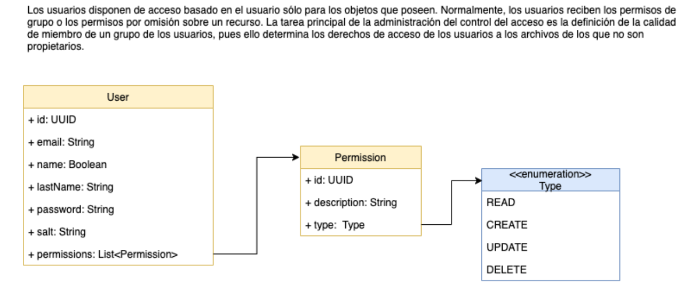

# Video Club - Práctica ACL

Práctica video-club ACL



### Pre-requisítos

node-js
mongodb

Usaremos el siguiente comando para instalar las dependencias del proyecto:

```
npm install
```

### Ejecución

Usar:

```
npm start
```

o crear la imagen de Docker:

```
docker build -t videoclub .
```

para despues ejecutarla con:

```
docker run -dti -p80:80 videoclub
```
o acceder a:

  - [Back4App](https://videoclub-olxlme8c.b4a.run/)

Podremos usar las siguientes rutas de ejemplo en:
- [Rutas Postman](https://www.postman.com/cryosat-operator-77440515/workspace/compartir)

## Hecho con

  - [Node-js](https://nodejs.org/es)
  - [MongoDB](https://www.mongodb.com)
  - [ACL](https://www.npmjs.com/package/acl).

## Autores

  - *Diego Martínez* -
    [DiegoMTZGlez](https://github.com/DiegoMTZGlz)
  - *Daniel Lozano* -
    [Daniel](https://gitlab.com/a348603)